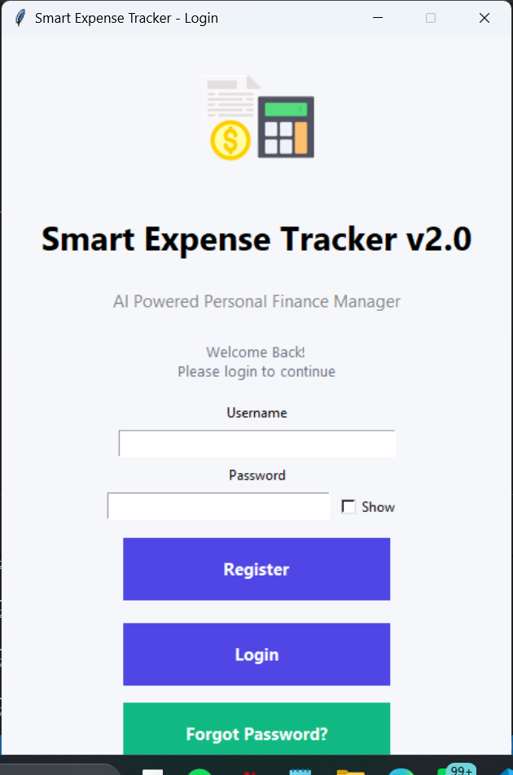
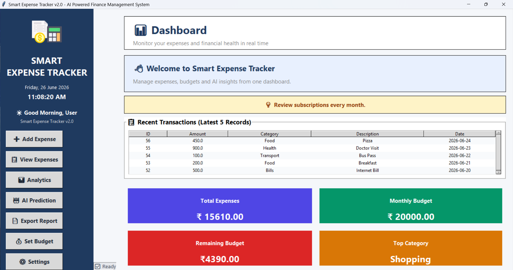
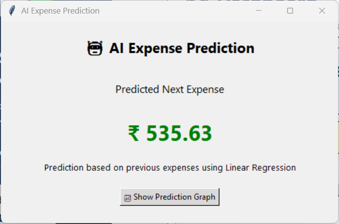

# 💰 Smart Expense Tracker v2.0

An AI-powered desktop application developed using **Python**, **Tkinter**, and **SQLite** for efficient personal expense management. The application enables users to record daily expenses, manage monthly budgets, analyze spending patterns, generate reports, and predict future expenses using Machine Learning.

---

## 📌 Project Overview

Managing daily expenses manually can be difficult and time-consuming. Smart Expense Tracker provides a simple desktop-based solution to monitor expenses, maintain budgets, generate reports, and gain financial insights through interactive dashboards and AI-based predictions.

This project was developed as part of an MCA academic project and demonstrates desktop application development using Python along with database integration, reporting, analytics, and basic machine learning.

---

# ✨ Features

### 👤 User Management
- User Login
- User Registration
- User Profile
- Change Password
- Forgot Password

### 💵 Expense Management
- Add Expense
- View Expenses
- Edit Expense
- Delete Expense
- Search Expenses
- Filter Expenses

### 📊 Dashboard
- Total Expenses
- Monthly Budget
- Remaining Budget
- Highest Spending Category
- Recent Transactions
- AI Tips

### 📈 Analytics
- Expense Analytics Table
- Expense Distribution Pie Chart
- Expense Trend Line Chart

### 🤖 AI Features
- Expense Prediction using Linear Regression
- AI Saving Suggestions

### 📄 Reports
- Export PDF Report
- Export Excel Report (.xlsx)
- Export CSV Report

### ⚙ Settings
- User Profile
- Change Password
- Forgot Password
- Help & User Guide
- About Software
- Backup Database
- Restore Database

---

# 🖥 Screenshots

## Login



---

## Dashboard



---

## Add Expense


---

## Expense Analytics


---

## AI Prediction



---

## Export Reports


---

## Settings


---

# 🛠 Technologies Used

| Technology | Purpose |
|------------|----------|
| Python | Programming Language |
| Tkinter | GUI Development |
| SQLite | Database |
| Matplotlib | Charts & Analytics |
| Scikit-Learn | AI Expense Prediction |
| ReportLab | PDF Report Generation |
| OpenPyXL | Excel Report Generation |
| CSV Module | CSV Export |
| Pillow | Image Handling |

---

# 📂 Project Structure

```
SmartExpenseTracker
│
├── assets/
├── backups/
├── database/
│   └── expense_tracker.db
│
├── docs/
│   └── database_schema.sql
│
├── exports/
├── screenshots/
│
├── gui.py
├── login.py
├── profile.py
├── about.py
├── help.py
├── change_password.py
├── forgot_password.py
├── backup_database.py
├── restore_database.py
│
├── README.md
├── LICENSE
├── requirements.txt
└── .gitignore
```

---

# ⚙ Installation

### Clone Repository

```bash
git clone https://github.com/shettynireeksha1412-dotcom/SmartExpenseTracker.git
```

---

### Move into Project

```bash
cd SmartExpenseTracker
```

---

### Install Dependencies

```bash
pip install -r requirements.txt
```

---

### Run Application

```bash
python login.py
```

---

# 🗄 Database

The project uses **SQLite**.

Database Location:

```
database/expense_tracker.db
```

Database Schema:

```
docs/database_schema.sql
```

---

# 📊 Reports Generated

The application can generate:

- PDF Report
- Excel Report (.xlsx)
- CSV Report

Reports are automatically saved inside:

```
exports/
```

---

# 🧠 Machine Learning

The project uses **Linear Regression** from **Scikit-Learn** to predict the user's next expected expense based on previous expense history.

---

# 💾 Backup & Restore

The application provides:

- Database Backup
- Database Restore

to protect user data.

---

# 📌 Future Enhancements

- Email Notifications
- Cloud Database Integration
- Mobile Application
- Receipt Scanner (OCR)
- Expense Categorization using AI
- Multi-user Support
- Monthly Financial Reports
- Data Visualization Dashboard
- Online Backup

---

# 📦 Requirements

Main Libraries:

- Python 3.x
- Tkinter
- SQLite3
- Pillow
- Matplotlib
- NumPy
- Scikit-Learn
- ReportLab
- OpenPyXL

Install using:

```bash
pip install -r requirements.txt
```

---

# 👩‍💻 Developer

**Nireeksha Shetty**

MCA Graduate

Python Developer | Desktop Application Developer | Machine Learning Enthusiast

---

# 📜 License

This project is licensed under the MIT License.

---

# ⭐ Acknowledgements

- Python Community
- Tkinter Documentation
- SQLite Documentation
- Scikit-Learn Documentation
- Matplotlib Documentation
- ReportLab Documentation

---

## 🌟 If you like this project, consider giving it a ⭐ on GitHub.